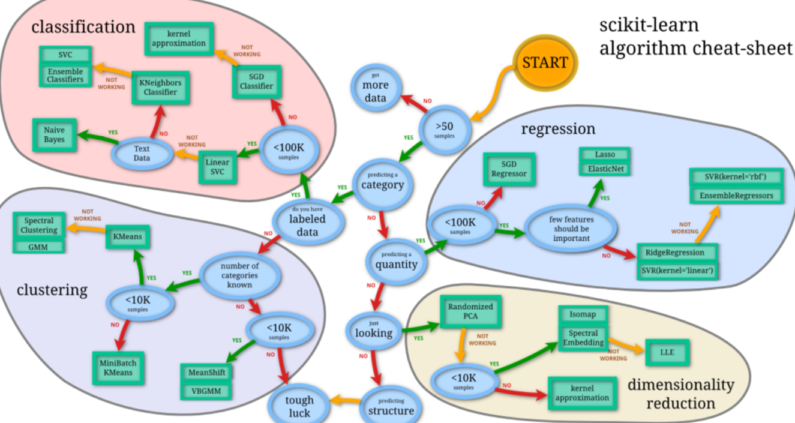

# sklearn 通用的学习模式

### 选择机器学习算法



### 导入模

```
from sklearn import datasets
from sklearn.model_selection import train_test_split
from sklearn.neighbors import KNeighborsClassifier
```

### 创建数据

加载 iris 的数据，把属性存在 X，类别标签存在 y：

```
iris = datasets.load_iris()
iris_X = iris.data
iris_y = iris.target
```
把数据集分为训练集和测试集，其中 test_size=0.3，即测试集占总数据的 30%：

```
X_train, X_test, y_train, y_test = train_test_split(iris_X, iris_y, test_size=0.3)
```
可以看到分开后的数据集，顺序也被打乱，这样更有利于学习模型：

### 定义模型－训练模型－预测

定义模块方式 KNeighborsClassifier()， 用 fit 来训练 training data，这一步就完成了训练的所有步骤， 后面的 knn 就已经是训练好的模型，可以直接用来 predict 测试集的数据， 对比用模型预测的值与真实的值，可以看到大概模拟出了数据，但是有误差，是不会完完全全预测正确的。

```
knn = KNeighborsClassifier()
knn.fit(X_train, y_train)
print(knn.predict(X_test))
print(y_test)
```

不仅仅是这个机器学习例子，使用sklearn其他的机器学习例子也是这样通用的。

#  Sklearn 中的 datasets，很多而且有用，可以用来学习算法模型。

[datasets](http://scikit-learn.org/stable/modules/classes.html#module-sklearn.datasets)


[以上是参考莫凡的教程](https://morvanzhou.github.io/tutorials/machine-learning/sklearn/)


